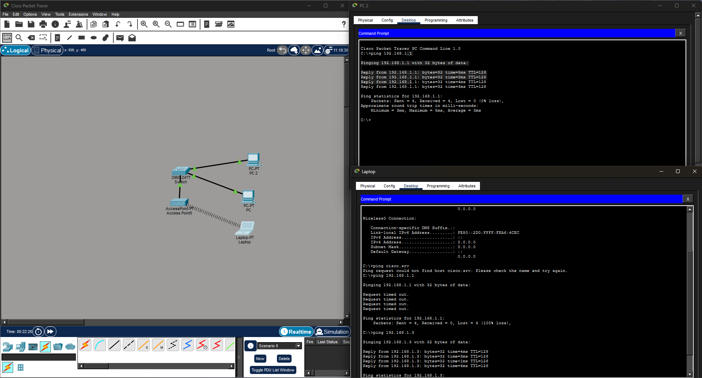

## `Laboratório de Redes: Conectividade LAN e WLAN`
Este projeto documenta a montagem de uma rede local simples utilizando o simulador Cisco Packet Tracer, integrando dispositivos cabeados e sem fio.

  ### Topologia

- 1 Switch (2960-24TT)
- 2 Computadores (PC-PT) conectados via cabo de cobre direto.
- 1 Access Point para sinal sem fio.
- 1 Laptop conectado via Wi-Fi.

### Objetivo
Praticar conceitos básicos de conectividade LAN/WLAN utilizando Cisco Packet Tracer.

### O que foi desenvolvido
Montagem Física: Conexão dos dispositivos utilizando cabos Ethernet (Cobre Direto).
Configuração Lógica: Atribuição de endereços IP estáticos para cada máquina na mesma sub-rede (192.168.1.x).
Implementação de Wi-Fi: Substituição da placa de rede do Laptop por uma placa wireless para conexão via Access Point.

### Resolução de Problemas 
Durante a prática, identifiquei um erro comum: o Laptop estava conectado fisicamente à antena, mas não conseguia se comunicar com os outros PCs (o comando ping falhava).

**O problema:** Ao trocar a placa de rede do Laptop, o endereço IP foi resetado para 0.0.0.0.

**A solução:**  Reconfigurei manualmente o endereço IP estático para 192.168.1.3. Após isso, a comunicação foi estabelecida com sucesso.

### Conclusão 
Este laboratório foi importante para eu colocar em prática conceitos básicos de redes que estou estudando, o que aprendi com isso foi:

**Lógica de rede:** O erro que encontrei com IP 0.0.0.0 foi bom para o aprendizado, ele me mostrou que a rede pode estar fisicamente montada, mas se a configuração estiver errada, os aparelhos não se comunicam.
**Resolução de problemas:** Aprender a identificar por que um comando "ping" falha e saber como ajustar as configurações para resolver o problema me deu mais segurança.

Esse projeto é o ponto para meus próximos esudos em infraestrutura e segurança de redes.

## Arquivo do Laboratório
[Baixar laboratório Packet Tracer](./teste1.pkt)
